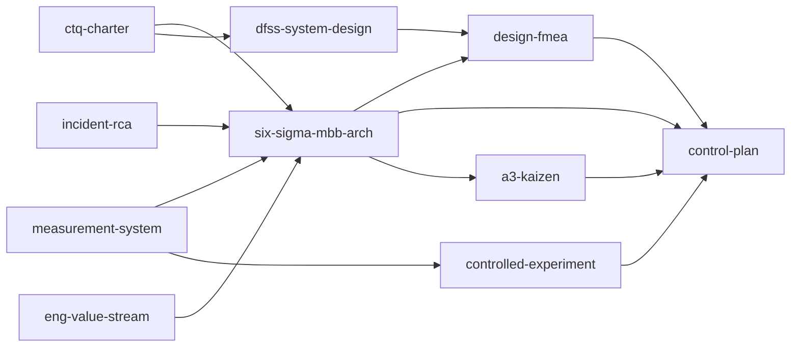

# Six Sigma MBB Skill Suite

Software-systems excellence skills that orbit the Master Black Belt architecture audit. Shared terms: [shared/vocabulary.md](shared/vocabulary.md).

## When to use which

| Need | Skill |
|------|-------|
| Vague problem / kickoff / define CTQs | `ctq-charter` |
| Are metrics trustworthy? What to instrument? | `measurement-system` |
| Architecture / design review / over-engineering | `six-sigma-master-black-belt` |
| Postmortem / recurring incident / defect escape | `incident-rca` |
| Slow PRs / lead time / delivery waste | `eng-value-stream` |
| Greenfield or major redesign from CTQs | `dfss-system-design` |
| Launch readiness / “what can go wrong?” | `design-fmea` |
| A/B, canary, “did the fix work?” | `controlled-experiment` |
| Lock gains / fitness functions / owners | `control-plan` |
| One local pain point (not whole-system) | `a3-kaizen` |

## Handoff map

## Typical paths

1. **Audit path:** `ctq-charter` → `six-sigma-master-black-belt` → `design-fmea` → `control-plan`
2. **Incident path:** `incident-rca` → (structural?) `six-sigma-master-black-belt` : `a3-kaizen` → `control-plan`
3. **Greenfield path:** `ctq-charter` → `dfss-system-design` → `design-fmea` → `control-plan`
4. **Validate Improve:** `measurement-system` → `controlled-experiment` → `control-plan`
5. **Flow path:** `eng-value-stream` → (structure is constraint?) `six-sigma-master-black-belt` : `control-plan`

## Install

See [README.md](README.md) for install-one and install-all commands.
